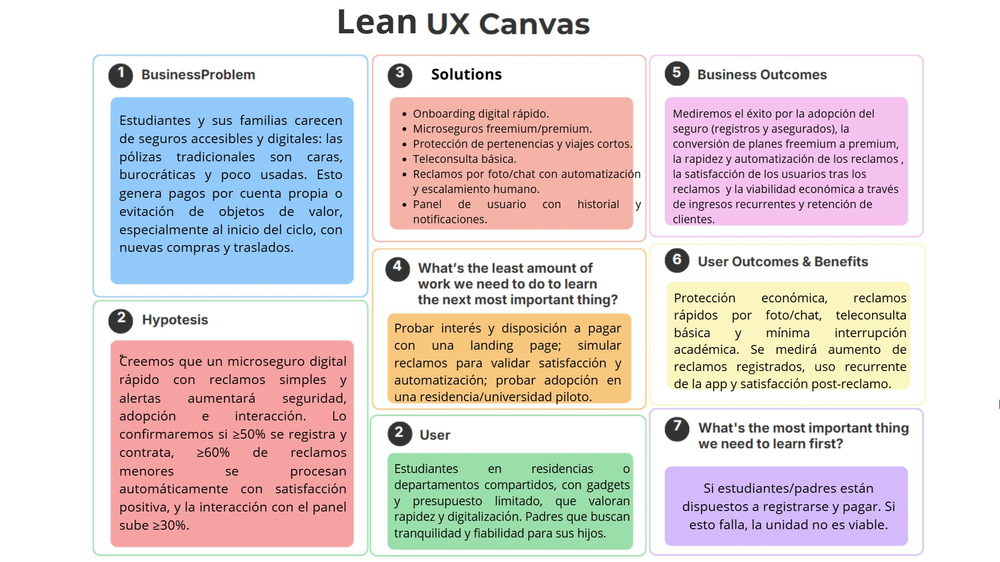

    

<h1 align="center">
    Universidad Peruana de Ciencias Aplicadas
</h1>

<h3 align="center">
    Carrera: Ingeniería de Software
       
    Curso: 1ASI0730 - Aplicaciones Web
       
    Sección: 7426
       
    Profesor: Naldo Reupo Musayon Gastulo
       
    Ciclo: 2025-02 
       
    Informe de Trabajo Final
       
    Startup: ResiSeguro
       
    Producto: ResiCare  
</h3>

| 
Alumno
       | 
Código
 |
|:-------------------------------------------:|:-------------------------------------:|
|  Hermoza Quispe, Jude Alessandro            |              u202318220               |
|       Ríos Pacheco, Héctor Javier           |              u20231c540               |
| Choy Robles, Vanessa May Lang               |              u202317450               |
|       Ramirez Escalante, Carlo Patricio     |              u202210787               |
|       Pariona Lucas, Jose Manuel            |              u202119257               |

 Septiembre 2025 

## Registro de Versiones del Informe
| Versión | Fecha       | Autor(es)     | Descripción de modificación                                                                                                                                                                                                                                                                                                                                                                                           |
|---------|-------------|----------|-----------------|
| 0.1     |   |             |           |

## Project Report Collaboration Insights  

Todas las actividades asignadas para la entrega de la TB1 han sido completadas y se encuentran documentadas en el repositorio de GitHub de la organización del equipo, accesible en: https://github.com/Grupo-2-Aplicaciones-Web-ResiSeguro . En cuanto al informe, cada miembro del equipo participó redactando y elaborando gráficos en formato Markdown de acuerdo con los temas asignados, registrando su progreso mediante commits en el repositorio correspondiente, encontrándose en el siguiente enlace: https://github.com/Grupo-2-Aplicaciones-Web-ResiSeguro/Informe-ResiCare
Aqui se pueden aprecion todos los commits hechos en la TB1 evidenciando el trabajo colaborativo.

**Insights Readme**

## Tabla de Contenidos

Capítulo I: Introducción    
        <ul>
            <li><a href="#11-Startup-Profile">1.1. Startup Profile</a></li>
            <li><a href="#111-Descripción-de-la-Startup">1.1.1. Descripción de la Startup</a></li>
            <li><a href="#112-Perfiles-de-Integrantes-del-Equipo">1.1.2. Perfiles de Integrantes del Equipo</a></li>
            <li><a href="#12-Solution-Profile">1.2. Solution Profile</a></li>
            <li><a href="#121-Antecedentes-y-Problemática">1.2.1. Antecedentes y Problemática</a></li>
            <li><a href="#122-Lean-UX-Process">1.2.2. Lean UX Process</a></li>
            <li><a href="#1221-Lean-UX-Problem-Statements">1.2.2.1. Lean UX Problem Statements</a></li>
            <li><a href="#1222-Lean-UX-Assumptions">1.2.2.2. Lean UX Assumptions</a></li>
            <li><a href="#1223-Lean-UX-Hypothesis-Statements">1.2.2.3. Lean UX Hypothesis Statements</a></li>
            <li><a href="#1224-Lean-UX-Canvas">1.2.2.4. Lean UX Canvas</a></li>
            <li><a href="#13-Segmentos-Objetivos">1.3. Segmentos Objetivos</a></li>
        </ul>    
        
Capítulo II: Requirements Elicitation & Analysis
        <ul>
            <li><a href="#21-competidores">2.1. Competidores</a></li>
            <li><a href="#211-Análisis-competitivo">2.1.1. Análisis competitivo</a></li>
            <li><a href="#212-Estrategias-y-tácticas-frente-a-competidores">2.1.2. Estrategias y tácticas frente a competidores</a></li>
            <li><a href="#22-Entrevistas">2.2. Entrevistas</a></li>
            <li><a href="#221-Diseño-de-entrevistas">2.2.1. Diseño de entrevistas</a></li>
            <li><a href="#222-Registro-de-entrevistas">2.2.2. Registro de entrevistas</a></li>
            <li><a href="#223-Análisis-de-entrevistas">2.2.3. Análisis de entrevistas</a></li>
            <li><a href="#23-Needfinding">2.3. Needfinding</a></li>
            <li><a href="#231-User-Personas">2.3.1. User Personas</a></li>
            <li><a href="#232-User-Task-Matrix">2.3.2. User Task Matrix</a></li>
            <li><a href="#233-User-Journey-Mapping">2.3.3. User Journey Mapping</a></li>
            <li><a href="#234-Empathy-Mapping">2.3.4. Empathy Mapping</a></li>
            <li><a href="#235-As-is-Scenario-Mapping">2.3.5. As-is Scenario Mapping</a></li>
            <li><a href="#24-Ubiquitous-Language">2.4. Ubiquitous Language</a></li>
        </ul>   

Capítulo III: Requirements Specification 
        <ul>
            <li><a href="#31-To-Be-Scenario-Mapping">3.1. To-Be Scenario Mapping</a></li>
            <li><a href="#32-User-Stories">3.2. User Stories</a></li>
            <li><a href="#33-Impact-Mapping">3.3. Impact Mapping</a></li>
            <li><a href="#34-Product-Backlog">3.4. Product Backlog</a></li>
        </ul>    
        
Capítulo IV: Product Design
        <ul>
            <li><a href="#41-Style-Guidelines">4.1. Style Guidelines</a></li>
            <li><a href="#411-General-Style-Guidelines">4.1.1. General Style Guidelines</a></li>
            <li><a href="#412-Web-Style-Guidelines">4.1.2. Web Style Guidelines</a></li>
            <li><a href="#42-Information-Architecture">4.2. Information Architecture</a></li>
            <li><a href="#421-Organization-Systems">4.2.1. Organization Systems</a></li>
            <li><a href="#422-Labeling-Systems">4.2.2. Labeling Systems</a></li>
            <li><a href="#423-SEO-Tags-and-Meta-Tags">4.2.3. SEO Tags and Meta Tags</a></li>
            <li><a href="#424-Searching-Systems">4.2.4. Searching Systems</a></li>
            <li><a href="#425-Navigation-Systems">4.2.5. Navigation Systems</a></li>
            <li><a href="#43-Landing-Page-UI-Design">4.3. Landing Page UI Design</a></li>
            <li><a href="#431-Landing-Page-Wireframe">4.3.1. Landing Page Wireframe</a></li>
            <li><a href="#432-Landing-Page-Mock-up">4.3.2. Landing Page Mock-up</a></li>
            <li><a href="#44-Web-Applications-UXUI-Design">4.4. Web Applications UX/UI Design</a></li>
            <li><a href="#441-Web-Applications-Wireframes">4.4.1. Web Applications Wireframes</a></li>
            <li><a href="#442-Web-Applications-Wireflow-Diagrams">4.4.2. Web Applications Wireflow Diagrams</a></li>
            <li><a href="#443-Web-Applications-Mock-ups">4.4.3. Web Applications Mock-ups</a></li>
            <li><a href="#444-Web-Applications-User-Flow-Diagrams">4.4.4. Web Applications User Flow Diagrams</a></li>
            <li><a href="#45-Web-Applications-Prototyping">4.5. Web Applications Prototyping</a></li>
            <li><a href="#46-Domain-Driven-Software-Architecture">4.6. Domain-Driven Software Architecture</a></li>
            <li><a href="#461-Software-Architecture-Context-Diagrams">4.6.1. Software Architecture Context Diagrams</a></li>
            <li><a href="#462-Software-Architecture-Container-Diagrams">4.6.2. Software Architecture Container Diagrams</a></li>
            <li><a href="#463-Software-Architecture-Components-Diagrams">4.6.3. Software Architecture Components Diagrams</a></li>
            <li><a href="#47-Software-Object-Oriented-Design">4.7. Software Object-Oriented Design</a></li>
            <li><a href="#471-Class-Diagrams">4.7.1. Class Diagrams</a></li>
            <li><a href="#472-Class-Dictionary">4.7.2. Class Dictionary</a></li>
            <li><a href="#48-Database-Design">4.8. Database Design</a></li>
            <li><a href="#481-Database-Diagram">4.8.1. Database Diagram</a></li>
        </ul>    

Capítulo V: Product Implementation, Validation & Deployment 
        <ul>
            <li><a href="#51-software-configuration-management">5.1. Software Configuration Management</a></li>
            <li><a href="#511-software-development-environment-configuration">5.1.1. Software Development Environment Configuration</a></li>
            <li><a href="#512-source-code-management">5.1.2. Source Code Management</a></li>
            <li><a href="#513-source-code-style-guide-conventions">5.1.3. Source Code Style Guide & Conventions</a></li>
            <li><a href="#514-software-deployment-configuration">5.1.4. Software Deployment Configuration</a></li>
            <li><a href="#52-landing-page-services-applications-implementation">5.2. Landing Page, Services & Applications Implementation</a></li>
            <li><a href="#521-sprint-1">5.2.1. Sprint 1</a></li>
            <li><a href="#5211-sprint-planning-1">5.2.1.1. Sprint Planning 1</a></li>
            <li><a href="#5212-aspect-leaders-and-collaborators">5.2.1.2. Aspect Leaders and Collaborators</a></li>
            <li><a href="#5213-sprint-backlog-1">5.2.1.3. Sprint Backlog 1</a></li>
            <li><a href="#5214-development-evidence-for-sprint-review">5.2.1.4. Development Evidence for Sprint Review</a></li>
            <li><a href="#5215-execution-evidence-for-sprint-review">5.2.1.5. Execution Evidence for Sprint Review</a></li>
            <li><a href="#5216-services-documentation-evidence-for-sprint-review">5.2.1.6. Services Documentation Evidence for Sprint Review</a></li>
            <li><a href="#5217-software-deployment-evidence-for-sprint-review">5.2.1.7. Software Deployment Evidence for Sprint Review</a></li>
            <li><a href="#5218-team-collaboration-insights-during-sprint">5.2.1.8. Team Collaboration Insights during Sprint</a></li>
            <li><a href="#conclusiones">6. Conclusiones</a></li>
            <li><a href="#bibliografia">7. Bibliografía</a></li>
            <li><a href="#anexos">8. Anexos</a></li>
        

**ABET – EAC - Student Outcome 5**

La capacidad de funcionar efectivamente en un
equipo cuyos miembros juntos proporcionan liderazgo, crean un entorno de
colaboración e inclusivo, establecen objetivos, planifican tareas y cumplen objetivos. 
En el siguiente cuadro se describe las acciones realizadas y enunciados de conclusiones por parte del grupo,
que permiten sustentar el haber alcanzado el logro del ABET – EAC - Student Outcome 5.

| Criterio específico | Acciones Realizadas | Conclusiones |
|---------------------|---------------------|--------------|
| Trabaja en equipo para proporcionar liderazgo en forma conjunta | | | |
|Crea un entorno colaborativo e inclusivo, establece metas, planifica tareas y cumple objetivos | | |

## Capítulo I: Introducción

### 1.1. Startup Profile
Somos un equipo de estudiantes de la Universidad Peruana de Ciencias Aplicadas (UPC) motivados en desarrollar una solución diferente que cuyo objetivo principal sea ayudar a los estudiantes cuya residencia princiapal se encuentra muy lejos, mediante un seguro que garantice su seguridad y protección.

#### 1.1.1. Descripción de la Startup
ResiSeguro es una startup enfocada en brindar protección rápida y digital a estudiantes universitarios que viven lejos de casa. Nuestro producto principal, ResiCare, ofrece seguros accesibles y personalizados para cubrir riesgos comunes en residencias estudiantiles, como robos, daños a pertenencias y emergencias. Utilizando tecnología digital, facilitamos la contratación y gestión de seguros de manera ágil, transparente y adaptada a las necesidades reales de los estudiantes, promoviendo su tranquilidad y bienestar durante su vida.

**Misión:** Brindar a los estudiantes universitarios una solución digital y accesible que proteja sus pertenencias y su tranquilidad mientras viven lejos de casa, facilitando seguros personalizados y procesos ágiles de gestión y reclamación.

**Visión:** Ser la startup líder en seguros digitales para estudiantes universitarios, reconocida por ofrecer protección confiable, rápida y adaptada a las necesidades de quienes residen fuera de su hogar, promoviendo su bienestar y seguridad en todo momento.

#### 1.1.2. Perfiles de Integrantes del Equipo

    

Soy responsable, me gusta involucrarme activamente en los proyectos, aportar ideas útiles y cumplir con mis tareas a tiempo. Siempre estoy dispuesto a colaborar y ayudar al equipo a avanzar de la mejor manera posible.

- Jude Alessandro Hermoza Quispe - u202318220 (Ingeniería de Software)

    

Soy una persona proactiva y comprometida con el trabajo en equipo. Me gusta aportar soluciones creativas, asumir retos y aprender constantemente. Valoro la comunicación clara y la organización para lograr los objetivos del proyecto de manera eficiente y colaborativa.

### 1.2. Solution Profile
ResiCare es un microseguro digital diseñado para estudiantes preuniversitarios y universitarios que viven en residencias estudiantiles, departamentos compartidos o en el campus. Permite contratar coberturas económicas y simples vía web orientadas a proteger pertenencias personales (gadgets, laptop, mochila), ofrecer asistencia médica básica (teleconsulta) y cubrir imprevistos en viajes cortos entre residencia y campus (cancelaciones menores, pérdida de equipaje en traslados interurbanos). La propuesta se centra en una afiliación rápida, reclamos sencillos por foto/chat y decisiones automáticas para siniestros menores, con una opción de escalamiento a revisión humana cuando corresponde. Modelo básico: Acceso a todas las caráticas menos el simulador y un monto menor de cobertura, (reportes, historial de reclamos prioritarios, mayor cobertura) en planes premium. Además cuenta con un simulador de devolución en caso de reclamar el seguro.

#### 1.2.1. Antecedentes y problemática

**What**  
- Los estudiantes y sus familias no tienen opciones de seguro accesibles, fáciles de contratar o que se adapten a la realidad estudiantil (dispositivos de uso diario, gastos médicos menores, traslados cortos). Las pólizas tradicionales suelen ser costosas, con procedimientos complejos y mal enfoque en reclamos rápidos y digitales, lo que deja a muchos sin protección ante robos, daños accidentales o necesidades de consulta médica básica. 

**When**  
 
- El problema es persistente y diario, pero suele intensificarse en momentos concretos:  al inicio del ciclo académico, antes de viajes intersemestrales o durante la temporada de compra de equipos (inicio de clases). Y puede tornarse más crítico en contextos de mayor movilidad estudiantil o cuando hay incremento de robos en áreas estudiantiles.

**Where**  

- Surge en el día a día estudiantil: dentro de residencias y departamentos compartidos (robos o daños en habitaciones y zonas comunes), en trayectos cortos hacia la universidad (pérdida de objetos, equipaje en viajes interurbanos) y al necesitar atención médica menor fuera de horarios convencionales (necesidad de teleconsulta).
 

**Who**  
- Principalmente se ven afectados dos grupos: Estudiantes universitarios que realizan una vida cerca o dentro del campus, y padres de estudiantes que tienen que sustentar a distancia la residencia y estadía de sus hijos debido a sus estudios.

**Why**  

- Este problema existe porque las alternativas existentes no están diseñadas para la escala, el presupuesto ni la velocidad que requieren los estudiantes: pólizas largas, procesos de reclamo presenciales o con documentación extensa, y coberturas desproporcionadas frente a pérdidas frecuentes y de bajo monto. 

**How**  

- No denuncian o no reclaman daños/robos por el trámite engorroso.

- Reemplazan o reparan a costo propio (impactando su economía y continuidad académica).

- Los padres asumen gastos inesperados o prefieren no enviar al estudiante a campus con objetos de valor por miedo a pérdidas.

- Las universidades y residencias enfrentan quejas recurrentes y falta de un mecanismo estandarizado para gestionar incidentes.  

**How much**  
- Según datos del Seguro Integral de Salud (SIS), más de 500,000 estudiantes universitarios en Perú no cuentan con un seguro de salud, lo que representa aproximadamente el 15% de la población estudiantil universitaria nacional.

#### 1.2.2. Lean UX Process

##### 1.2.2.1. Lean UX Problem Statements

##### 1.2.2.2. Lean UX Assumptions

##### 1.2.2.3. Lean UX Hypothesis Statements
**1ra Hipótesis**  
**Creemos que** ofrecer un microseguro digital rápido y económico para estudiantes aumentará la percepción de seguridad y tranquilidad entre los estudiantes.  
**Sabremos que estamos bien cuando** veamos que al menos el 50% de los estudiantes encuestados en residencias o departamentos compartidos se registran y contratan un plan dentro del primer mes de disponibilidad.

---

**2da Hipótesis**  
**Creemos que** permitir que los estudiantes realicen reclamos simples mediante foto y chat con decisiones automáticas incrementará la adopción y uso de la plataforma.  
**Sabremos que esto es cierto cuando** más del 60% de los reclamos menores sean procesados automáticamente y los estudiantes reporten satisfacción positiva con la experiencia de reclamo.

---

**3ra Hipótesis**  
**Creemos que** incluir recordatorios y alertas sobre cobertura, vencimiento de plan o precauciones de seguridad aumentará la interacción frecuente con la aplicación y la percepción de valor del seguro.  
**Sabremos que estamos teniendo éxito cuando** el número de usuarios que revisan su panel de seguros o reciben alertas aumente en al menos un 30% durante los primeros dos meses tras activar esta funcionalidad.

##### 1.2.2.4. Lean UX Canvas

A continuación se puede visualizar el Lean UX Canvas donde se estructura y valida rápidamente ideas de producto.

  

Visualizar diseño en Canva: https://www.canva.com/design/DAGlJa5hM50/r6zjjmIBlYsMarSUoKuRaQ/edit?utm_content=DAGlJa5hM50&utm_campaign=designshare&utm_medium=link2&utm_source=sharebutton

### 1.3. Segmentos Objetivos

### Segmento Objetivo 1: Estudiantes

- Sexo: Masculino y Femenino

- Edades: 16–25 años

- Nivel Socioeconómico: Medio–medio alto

- Ocupación: Estudiantes preuniversitarios y universitarios

- Ingresos: Limitados, generalmente dependientes de sus padres

#### Aspectos Geográficos:

- Nacionalidad: Peruana

- Ubicación Actual: Residencias estudiantiles, departamentos compartidos o campus

- Acceso a Tecnología: Smartphones, laptops, internet frecuente

#### Aspectos Psicográficos:

- Motivaciones: Seguridad de sus pertenencias, rapidez en procesos, tranquilidad académica

- Estilo de vida: Vida universitaria activa, movilidad entre residencia y campus

- Preocupaciones: Pérdida o daño de gadgets y pertenencias

- Adaptación a la tecnología: Alta, prefieren soluciones digitales

- Interés por la Personalización: Medio, valoran servicios adaptados a sus necesidades

### Segmento Objetivo 2: Padres de estudiantes

- Sexo: Masculino y Femenino

- Edades: 35–60 años

- Nivel Socioeconómico: Medio–medio alto

- Ocupación: Profesionales o trabajadores estables

- Ingresos: Medios a altos, pueden pagar microseguros

#### Aspectos Geográficos:

- Nacionalidad: Peruana

- Ubicación Actual: Principales ciudades del país

- Acceso a Tecnología: Smartphones y uso regular de internet

#### Aspectos Psicográficos:

- Motivaciones: Tranquilidad y protección para sus hijos

- Estilo de vida: Familiar, con preocupación por educación y seguridad de hijos

- Preocupaciones: Riesgos que afectan a sus hijos, gastos inesperados

- Adaptación a la tecnología: Media, aceptan soluciones digitales si son sencillas

- Interés por la Personalización: Medio, buscan servicios confiables y fáciles de usar

## Capítulo II: Requirements Elicitation & Analysis

### 2.1. Competidores

#### 2.1.1. Análisis competitivo
|  | **ResiCare**  | **Insurama**  | **Rimac**  | **Pacífico**  |
|---------------------------------------------------------------|-----------------------------|---------------------------|---------------------------|---------------------------|
| **Perfil** Overview | Startup peruana enfocada en microseguros digitales para estudiantes universitarios y preuniversitarios en residencias o campus. Cubre gadgets, viajes cortos y asistencia médica básica con modelo básico y reclamos automáticos vía foto/chat. | Insurtech internacional especializada en seguros para dispositivos (celulares, laptops, multidispositivo). Contratación digital (web/WhatsApp), cobertura por daños, robos y accidentes; expansión en LATAM. | Aseguradora líder en Perú, ofrece seguros de salud, vida y accidentes, incluyendo pólizas universitarias. Reconocida por su red de clínicas, app y soporte 24/7. | Aseguradora tradicional que ofrece seguros de accidentes estudiantiles contratados por instituciones. Cobertura dentro y fuera del centro educativo, asistencia 24/7 y confianza de marca. |
| **Ventaja competitiva** ¿Qué valor ofrece a los clientes? | Cobertura específica a la vida universitaria: gadgets, teleconsulta, viajes cortos. Modelo básico accesible y reclamos automáticos simples. Y un simulador de reposición económica por pérdida y otros agravios.  | Foco directo en protección de dispositivos, sin deducibles en algunos planes, experiencia digital rápida. | Respaldo de marca, red médica robusta y cobertura integral. | Cobertura 24/7 de accidentes estudiantiles, acceso institucional y solidez de marca. |

| **Perfil de marketing** |  |  |  |  |
|-------------------------|--|--|--|--|
| **Mercado objetivo** | Estudiantes (16–25 años)  medio–medio alto y padres (35–60 años) que financian su estancia y se preocupan por sus hijos y su seguridad. | Usuarios jóvenes/adultos con gadgets valiosos; clientes retail y telecom. | Familias, estudiantes mediante universidades, y empresas. | Instituciones educativas y padres que buscan seguridad para hijos. |
| **Estrategias de marketing** | Ads en redes sociales (TikTok, IG), alianzas con universidades/residencias, referidos entre estudiantes, cross-sell con tiendas de tecnología. | Alianzas con retailers, telecom y bancos; campañas digitales al comprar dispositivos. | Alianzas institucionales con universidades; comunicación de confianza; canales tradicionales y digitales (app). | Venta B2B a colegios y universidades; promoción en matrículas; comunicación institucional. |

| **Perfil de Producto** |  |  |  |  |
|------------------------|--|--|--|--|
| **Productos & Servicios** | Plan básico (gadgets + teleconsulta básica) con reposición por daños por montos menores; planes premium con mayor cobertura, historial de reclamos, viajes cortos. | Seguros de celulares, laptops y multidispositivo (rotura, robo, daño líquido, avería). | Seguros de salud, vida, accidentes y universitario; asistencia médica 24/7. | Seguro de accidentes estudiantiles con cobertura 24/7 y asistencia en emergencias. |
| **Precios & Costos** | Básico s/. /mesA ; premium S/ B mes.  | Prima mensual según valor del equipo; sin deducible en algunos planes. Aprox s/ 17/mes| Precio alto (cobertura integral y red médica amplia); costos operativos elevados. Aprox s/ 18.5/mes | Tarifas colectivas según institución; costos asociados a red médica y gestión. Aprox s/ 37.87/mes |
| **Canales de distribución** | Web y móvil responsive, integración con apps universitarias, WhatsApp, alianzas retail. | Web, móvil, WhatsApp, retailers y telecom partners. | Web, app móvil, agentes y acuerdos institucionales. | B2B con instituciones educativas; web y agentes institucionales. |

| **FODA** |  |  |  |  |
|----------|--|--|--|--|
| **Fortalezas** | Foco en estudiantes, agilidad digital, modelo básico y premium. | Especialización en tecnología, experiencia digital ágil. | Confianza de marca, amplia red médica, solidez financiera. | Canales institucionales sólidos, cobertura amplia de accidentes. |
| **Oportunidades** | Alianzas con universidades y residencias, convenios con tiendas de tecnología. | Expandirse al mercado estudiantil, convenios con universidades. | Adaptar productos a microseguros digitales para jóvenes. | Añadir coberturas de gadgets, convenios con retail. |
| **Debilidades** | Marca nueva, bajo volumen inicial, riesgo de fraude en reclamos digitales. | Enfoque limitado a dispositivos, no incluye salud ni viajes. | Procesos más lentos, precios altos para estudiantes. | Reclamos poco ágiles, producto no adaptado a gadgets. |
| **Amenazas** | Entrada de grandes aseguradoras en microseguros estudiantiles, insurtechs posicionadas. | Competencia en precios y entrada de aseguradoras tradicionales. | Insurtechs más ágiles y económicas. | Insurtechs direct-to-consumer con soluciones más baratas. |

#### 2.1.2. Estrategias y tácticas frente a competidores

### 2.2. Entrevistas

#### 2.2.1. Diseño de entrevistas

#### 2.2.2. Registro de entrevistas

#### 2.2.3. Análisis de entrevistas

### 2.3. Needfinding

#### 2.3.1. User Personas

#### 2.3.2. User Task Matrix

#### 2.3.3. User Journey Mapping

#### 2.3.4. Empathy Mapping

#### 2.3.5. As-is Scenario Mapping

### 2.4. Ubiquitous Language

## Capítulo III: Requirements Specification

### 3.1. To-Be Scenario Mapping

### 3.2. User Stories

### 3.3. Impact Mapping

### 3.4. Product Backlog

## Capítulo IV: Product Design

### 4.1. Style Guidelines

#### 4.1.1. General Style Guidelines

#### 4.1.2. Web Style Guidelines

### 4.2. Information Architecture

#### 4.2.1. Organization Systems

#### 4.2.2. Labeling Systems

#### 4.2.3. SEO Tags and Meta Tags

#### 4.2.4. Searching Systems

#### 4.2.5. Navigation Systems

### 4.3. Landing Page UI Design

#### 4.3.1. Landing Page Wireframe

#### 4.3.2. Landing Page Mock-up

### 4.4. Web Applications UX/UI Design

#### 4.4.1. Web Applications Wireframes

#### 4.4.2. Web Applications Wireflow Diagrams

#### 4.4.3. Web Applications Mock-ups

#### 4.4.4. Web Applications User Flow Diagrams

### 4.5. Web Applications Prototyping

### 4.6. Domain-Driven Software Architecture

#### 4.6.1. Software Architecture Context Diagrams

#### 4.6.2. Software Architecture Container Diagrams

#### 4.6.3. Software Architecture Components Diagrams

### 4.7. Software Object-Oriented Design

#### 4.7.1. Class Diagrams

#### 4.7.2. Class Dictionary

### 4.8. Database Design

#### 4.8.1. Database Diagram

## Capítulo V: Product Implementation, Validation & Deployment

### 5.1. Software Configuration Management

#### 5.1.1. Software Development Environment Configuration

#### 5.1.2. Source Code Management

#### 5.1.3. Source Code Style Guide & Conventions

#### 5.1.4. Software Deployment Configuration

### 5.2. Landing Page, Services & Applications Implementation

#### 5.2.1. Sprint 1

##### 5.2.1.1. Sprint Planning 1

##### 5.2.1.2. Aspect Leaders and Collaborators

##### 5.2.1.3. Sprint Backlog 1

##### 5.2.1.4. Development Evidence for Sprint Review

##### 5.2.1.5. Execution Evidence for Sprint Review

##### 5.2.1.6. Services Documentation Evidence for Sprint Review

##### 5.2.1.7. Software Deployment Evidence for Sprint Review

##### 5.2.1.8. Team Collaboration Insights during Sprint

## 6. Conclusiones

## 7. Bibliografía

## 8. Anexos
